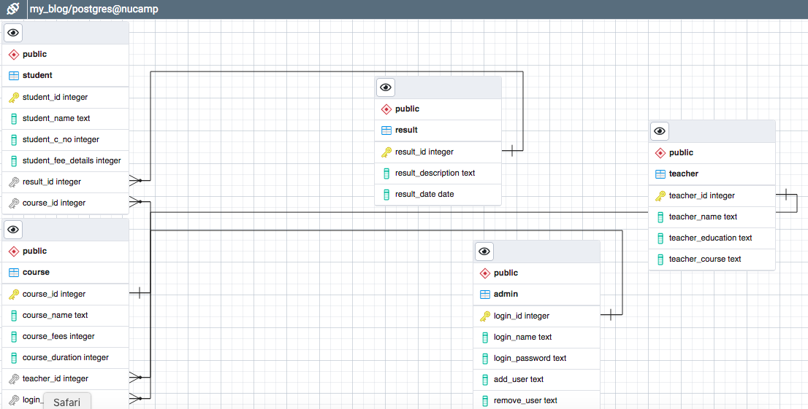
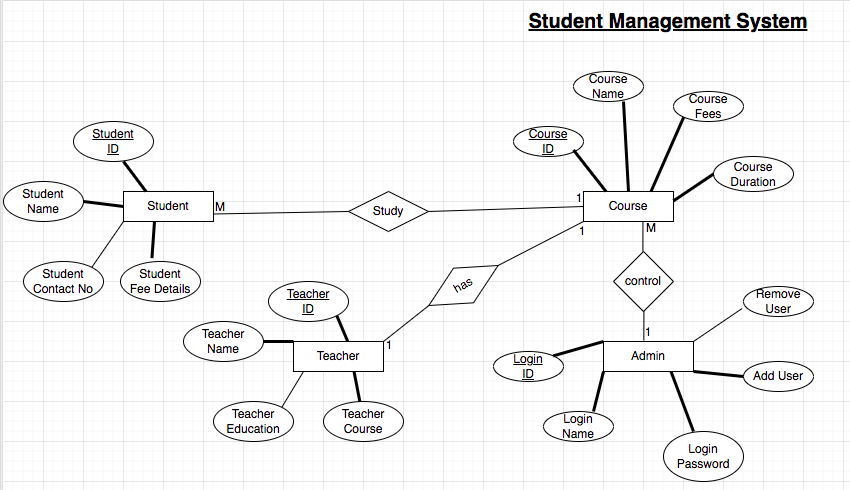

Title: Student Management System

Django Link: http://127.0.0.1:8000/
Git-hub Repository: https://github.com/kc-dipendra/portfolioproject.git

**Description**: 
The student management system has been created using Python & Django. For the database, I am using 'SQLite'. It is a web-based program which gives user an interacive menus.

**Instruction to start**
From the terminal, locate your project folder, where your ‘manage.py’ is located.
To start the server:
Run ‘python3 manage.py runserver’

In the browser, type ‘127.0.0.1:8000’
Your’ll see a home page.
Sign-in to see the features, else get registered in not. Normal user cannot do all the activities.
If user get logged in as 'admin', they can see all the menus/options, else, they cannot.
In the same way, if log-in, logout appears.
If logout, it appears register and login.

Admin username: admin
Admin password: password

**Inside the Program**
Once you login in 'http://127.0.0.1:8000/' to this link, you will find a main home page, where you have multiple options. For the time being, in order to view or add student, teacher, course, admin, users, you need to click in '1. Admin Page'. You will be asked to enter username and password, for now, username is 'postgres' and password 'password'.  

In this page, you  can add or view 'Admin', can view and create users, can view or create courses, view or add student and finally, view and add teachers.

**Furutur Plan**
To make it professional, fully functional will be my goal. I want to utilize all my knowledge and experiences that I gained from Nucamp bootcamp to make it more better. 

Some Screenshots of Student Management System
**ER Diagram**

**Flow Chart**

**Program Looks**

